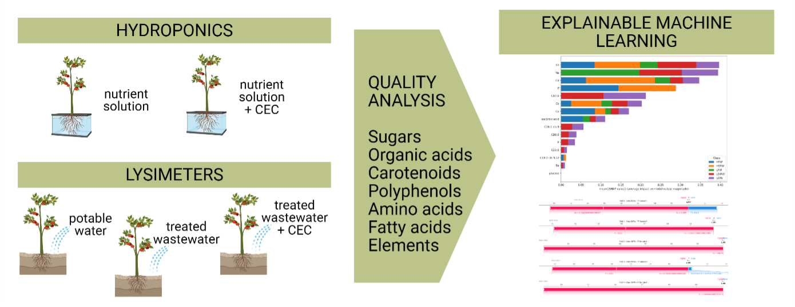
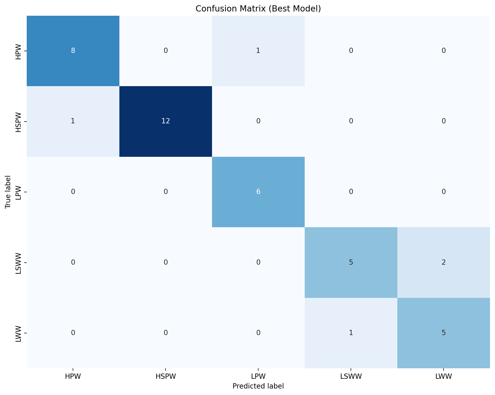
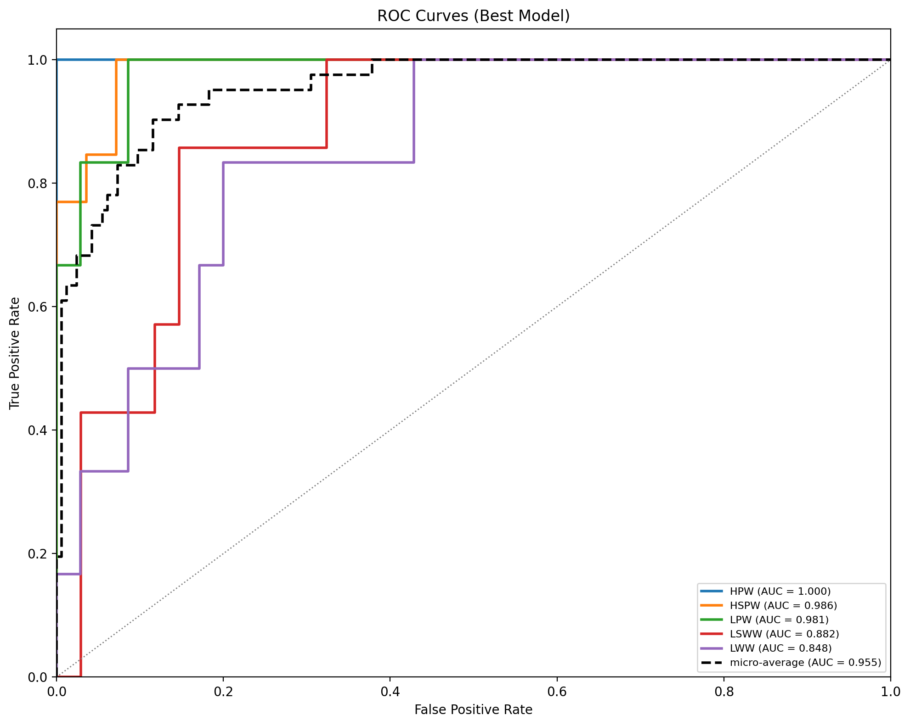
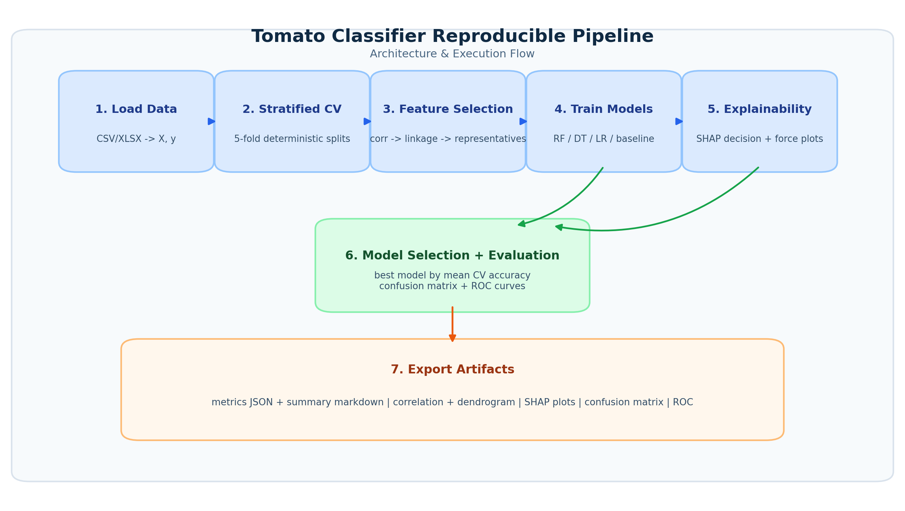

# Tomato Treatment Classification from Chemical Profiles

[](https://www.python.org/)
[](LICENSE)



## Abstract / Overview
This repository provides a reproducible machine-learning workflow for classifying tomato samples into cultivation/irrigation treatment classes using chemical measurements. The codebase was refactored from a monolithic notebook into a modular scientific software package with explicit configuration, reproducibility controls, and baseline validation against reference metrics.

## Key Features
- Reproducible pipeline reproducing original fold-level metrics.
- Modular package under `src/tomato_classifier` with typed configuration.
- Hierarchical clustering feature selection (correlation-driven representatives).
- Multi-model training (Random Forest, Decision Tree, Logistic Regression, baseline).
- SHAP explainability with decision and force plot exports.
- Confusion matrix and ROC curve generation for the best CV model.
- Automated validation against reference baseline metrics.

## Results Preview




Quantitative reproducible run summary (5-fold CV over repository default dataset):
- Logistic Regression mean test accuracy: **0.7500**
- Random Forest mean test accuracy: **0.7778**
- Decision Tree mean test accuracy: **0.8750**
- Dummy baseline mean test accuracy: **0.3194**

## Repository Structure
```text
project/
├── data/                      # Dataset location (with .gitignore)
├── notebooks/                 # Jupyter notebooks
├── src/                       # Source code modules
├── results/                   # Output figures and metrics
├── configs/                   # Configuration files
└── tests/                     # Unit tests
```

Expanded source layout:
```text
src/tomato_classifier/
├── config/                    # Typed schema + YAML loader
├── data/                      # Data I/O + fold generation
├── features/                  # Clustering-based selection
├── models/                    # Model registry + train helpers
├── explainability/            # SHAP values + decision/force plots
├── visualization/             # Correlation, dendrogram, tree, performance plots
├── evaluation/                # Metric/report writers
├── pipeline/                  # Reproducible runner + validator
└── utils/                     # Seeds, paths, logging
```

## Installation Guide
### System Requirements
- OS: macOS / Linux / Windows
- Python: 3.13 (tested)
- RAM: 8 GB recommended
- GPU: not required

### pip (recommended)
```bash
python -m venv venv
source venv/bin/activate
pip install -r requirements.txt
```

### conda
```bash
conda env create -f environment.yml
conda activate tomato_classifier
```

### Install as package
```bash
pip install -e .
```

## Quick Start / Usage

### 1. Run reproducible pipeline
Set `data.path` in `configs/reproducible_run.yaml` to your local private dataset first.

```bash
python scripts/run_reproducible_pipeline.py --config configs/reproducible_run.yaml
```

### 2. Validate run output against reference baseline metrics
```bash
python scripts/validate_reproducibility.py \
  --baseline tests/fixtures/reference_metrics.json \
  --current results/reproducible_run/metrics/run_metrics.json
```

### 3. Open narrative notebook
- `notebooks/reproducible_pipeline.ipynb`

Expected runtime (CPU):
- Full reproducible pipeline: ~10-30 seconds (dataset-size dependent)

## Dataset Information
- Raw datasets are not published in this repository until paper acceptance.
- Expected local dataset paths used in this project:
  - `../TomatoPredictor/Vsi_podatki_brez_null.xlsx` (Available upon paper acceptance)
  - `data/tomato_elements_isotopes.csv` (Available upon paper acceptance)
- Set `data.path` in `configs/reproducible_run.yaml` to the local path you have available.
- A placeholder/data policy note is available at `data/README.md`.
- Samples: 41
- Columns: 72 total (70 model features + `Sample` + `Target`)
- Classes: `HPW`, `HSPW`, `LPW`, `LSWW`, `LWW`

Data split protocol:
- Stratified 5-fold CV (`shuffle=True`, `random_state=42`)

Preprocessing:
- No global scaling before feature selection.
- Per-fold feature reduction to 30 representatives via hierarchical clustering on `1 - |corr|`.

## Methodology


Pipeline outline:
1. Load dataset and split features/target.
2. Generate stratified folds.
3. Compute per-fold feature correlation, Ward linkage, and cluster representatives.
4. Train RF, DT, LR, and baseline per fold.
5. Compute SHAP values (Decision Tree) and export decision/force plots.
6. Select best model by mean fold test accuracy and export confusion matrix + ROC curves.
7. Aggregate metrics and validate against reference baseline metrics.

Key hyperparameters:
- `n_splits=5`, `random_state=42`
- `n_attributes=30` feature clusters
- `LogisticRegression(max_iter=1000)`

## Reproducibility
- Seed controls in config (`reproducibility.global_seed`).
- Deterministic fold splits and model seeds (`fold_index`).
- Baseline reproducibility check included.

Hardware used for latest reproducible run:
- CPU-only local run (no GPU dependency).

Verification outputs:
- `results/reproducible_run/metrics/run_metrics.json`
- `results/reproducible_run/metrics/run_summary.md`
- `results/reproducible_run/metrics/reproducibility_validation.json`
- `results/reproducible_run/figures/confusion_matrix_<best_model>.png`
- `results/reproducible_run/figures/roc_curves_<best_model>.png`

## Citation
```bibtex
@misc{tomato_classification_2026,
  title        = {Tomato Treatment Classification from Chemical Profiles},
  author       = {Jandrole, Anjavehar},
  year         = {2026},
  howpublished = {GitHub repository},
  note         = {Refactored reproducible scientific software release}
}
```

Paper link: add your publication URL here when available.

## License
Recommended: **MIT License** (included via `LICENSE` file if added).

## Authors and Contact
- Jan Drole (code)
- Anja Vehar (analysis)
- Email: `jan.drole@ijs.si`

## Acknowledgments
- Original notebook-based experimental workflow.
- SHAP and scikit-learn communities.
- Dataset providers and research collaborators.
